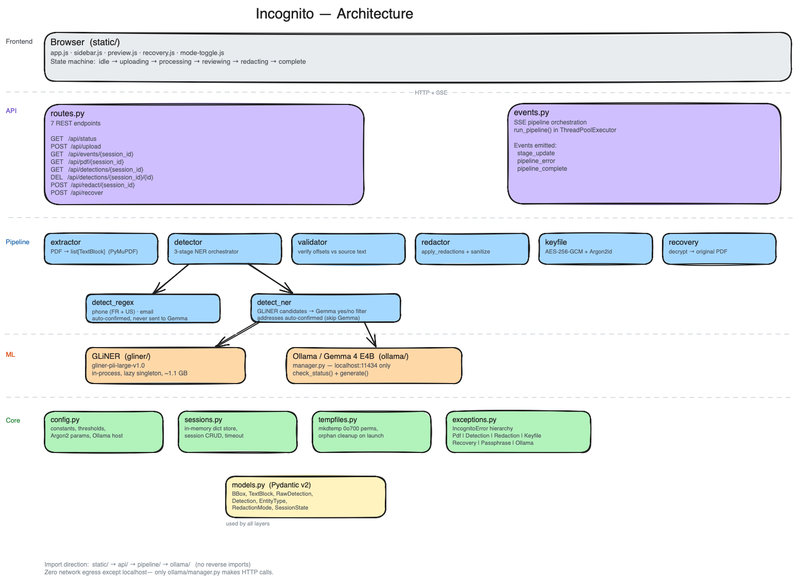
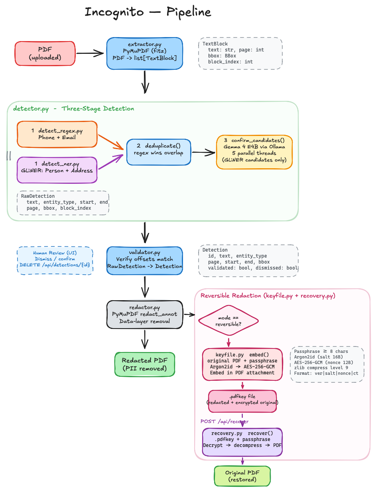

# incognito.ai

100% local PII anonymizer for administrative and medical PDFs.

Drag a PDF into Incognito. Regex and a lightweight Named Entity Recognition (NER) model catch person names, phone numbers, email addresses, and postal addresses. Gemma 4 E4B (running locally via Ollama) confirms person candidates. Review the highlights, dismiss false positives, click Redact. The output PDF has all confirmed Personally Identifiable Information (PII) **permanently deleted from the data layer** — not hidden behind cosmetic rectangles, but irrecoverably removed. Verify it yourself: `pdftotext redacted.pdf -` returns nothing. Incognito also offers a reversible option. On the review page, click Reversible and enter a password. The output is a .pdfkey file with all PII removed. In Incognito, click Recover, drag in the .pdfkey file, enter the password, click Recover Document, and the output is your original PDF.  

No data ever leaves your machine.

Built for the [Kaggle Gemma 4 Good Hackathon](https://www.kaggle.com/competitions/gemma-4-good-hackathon) (Safety & Trust track, deadline May 18, 2026).

## Why this exists

AI adoption in regulated organizations is blocked by a simple problem: documents contain PII, and there's no practical way to strip it before sharing or feeding into AI systems. Manual redaction takes 30-60 minutes per document and misses things. Cloud-based anonymization defeats the purpose — the data still leaves the building.

incognito.ai uses AI to make AI safe to use. Regex patterns, GLiNER and Gemma 4 identify PII, so documents can be safely fed into any downstream AI tool. The redacted PDF is genuinely clean — provable via text extraction, not by trust.

**AI for AI safety.**

## What makes this different

- **True redaction.** PII is removed from the PDF data layer via PyMuPDF `apply_redactions()`, not drawn over with rectangles. `pdftotext` on the output returns zero PII. Metadata, XMP, and document history are stripped.
- **100% local.** GLiNER runs in-process, Gemma 4 E4B runs on-device via Ollama. No GPU required. Zero network calls at runtime except `localhost:11434`.
- **Human-in-the-loop.** Every detection is shown before redaction. Dismiss false positives, approve the rest. Non-negotiable in regulated environments.
- **Reversible mode.** Optionally produce a `.pdfkey` file — a valid redacted PDF that embeds encrypted recovery data (AES-256-GCM + Argon2id). Without the passphrase, it behaves as a standard redacted PDF. With the passphrase, the original is restored. One file, two levels of access.

## Installation guide

### Option 1 — Download the macOS app

1. **Download the `.dmg`** from [Google Drive](https://drive.google.com/file/d/1XUjJgaBgp8PmQ0bpJtlJVfBQLQamjXTW/view?usp=sharing).
2. Open the `.dmg` and drag **Incognito** into your Applications folder.
3. On first launch, macOS may warn about an unidentified developer. Go to **System Settings > Privacy & Security** and click **Open Anyway**.

### Option 2 — Run from source

#### Prerequisites

- macOS on Apple Silicon (M1 or later) or Linux (Ubuntu 22.04+)
- Python 3.13+
- [uv](https://docs.astral.sh/uv/) package manager
- [Ollama](https://ollama.com) installed and running
- ~3 GB of free disk space (Ollama + Gemma 4 E4B model)

#### Setup

```bash
# Install and start Ollama, pull the model (~2.5 GB, one-time)
ollama serve &
ollama pull gemma4:e4b

# Clone and install
git clone https://github.com/YOUR_USERNAME/incognito-ai.git
cd incognito-ai
uv sync
```

#### Run

```bash
uv run incognito
```

The app opens in your browser at `http://127.0.0.1:8642`. Drop a PDF, review detections, redact.

#### Verify redaction

```bash
pdftotext document_redacted.pdf - | grep -i "dupont"
# (nothing)
```

## Architecture



## How it works



```
PDF → per-block text extraction (PyMuPDF)
    → regex detection (phone numbers, email addresses)
    → GLiNER candidate detection (person names, addresses)
    → deduplication
    → Gemma 4 E4B confirmation of person candidates (via Ollama)
    → address candidates auto-confirmed (Gemma skipped)
    → post-detection validation (verify offsets match source text)
    → human review (sidebar list, dismiss false positives)
    → true redaction (apply_redactions + metadata strip + XMP strip + garbage collection + non-incremental save)
    → redacted PDF download
```

Each text block's bounding box is preserved from extraction through redaction — no fragile offset-to-coordinate mapping.

### Reversible mode

When toggled on, the pipeline branches after redaction:

```
redacted PDF + original PDF bytes + passphrase
    → zlib compress → Argon2id key derivation → AES-256-GCM encrypt
    → embed as PDF attachment (recovery.bin)
    → .pdfkey file download
```

The `.pdfkey` file opens as a normal redacted PDF in any reader. Recovery requires incognito.ai and the passphrase.

## Architecture

```
src/incognito/
├── api/            # FastAPI routes (7 endpoints) + SSE streaming
├── core/           # Config, exceptions, TempFileManager, sessions
├── gliner/         # GLiNER model loader (in-process NER for persons/addresses)
├── pipeline/       # The processing pipeline (sync, pure functions)
│   ├── extractor   # PDF → list[TextBlock]
│   ├── detect_regex # Regex-based detection (phone, email)
│   ├── detect_ner  # GLiNER candidates + Gemma confirmation
│   ├── detector    # Three-stage orchestrator: regex → GLiNER → Gemma confirm
│   ├── validator   # list[RawDetection] → list[Detection]
│   ├── redactor    # list[Detection] + PDF → redacted PDF
│   ├── keyfile     # redacted PDF + original + passphrase → .pdfkey
│   └── recovery    # .pdfkey + passphrase → original PDF
├── ollama/         # Readiness check + inference (only module touching network)
└── static/         # Vanilla HTML/CSS/JS + PDF.js (vendored)
```

Import direction: `static/ → api/ → pipeline/ → ollama/`. No reverse imports. Enforced by `import-linter`.

## API surface

| Endpoint | Method | Purpose |
|---|---|---|
| `/api/status` | GET | Ollama/model readiness |
| `/api/upload` | POST | Upload PDF, start detection pipeline |
| `/api/events/{session_id}` | GET | SSE stream for processing progress |
| `/api/detections/{session_id}` | GET | List detected PII entities |
| `/api/detections/{session_id}/{id}` | DELETE | Dismiss a false positive |
| `/api/redact/{session_id}` | POST | Trigger redaction (irreversible or reversible) |
| `/api/recover` | POST | Recover original from `.pdfkey` + passphrase |

## GDPR compliance

Each GDPR principle maps to a verifiable property:

| GDPR Principle | How incognito.ai enforces it | Verification |
|---|---|---|
| Data minimisation | No PII stored persistently | No `pickle`, `shelve`, `sqlite3` in `src/` |
| Purpose limitation | No telemetry, no metadata collection | Only HTTP call is to Ollama on localhost |
| Storage limitation | Temp dirs auto-cleaned after processing | `test_no_temp_files_survive` in test suite |
| Lawful basis (local only) | Zero outbound network | `pytest-socket` blocks all non-localhost connections |
| Right to erasure | PII removed at data layer | `pdftotext` on redacted output returns zero PII |
| Consent (reversible mode) | Recovery data only on explicit opt-in + passphrase | No recovery data created by default |

## Evaluation

The evaluation corpus lives in `tests/evaluation/corpus/` and contains two synthetic administrative PDFs with ground-truth PII annotations: `housing_allocation_decision_notice.pdf` and `ssa_benefit_verification.pdf`. You can drop either file into the app to see the full pipeline in action.

```bash
# Run the F1 evaluation corpus
make eval
# or
pytest -m eval

# Run PII leakage tests
pytest -m leakage
```

Current results on the evaluation corpus:

| Entity    | Precision | Recall | F1   |
|-----------|-----------|--------|------|
| Person    | 1.00      | 0.87   | 0.93 |
| Address   | 0.67      | 0.60   | 0.63 |
| Phone     | 1.00      | 1.00   | 1.00 |
| Email     | 1.00      | 1.00   | 1.00 |
| **Micro** | **0.91**  | **0.83** | **0.87** |

### Gemma 4 E4B impact on person detection

| | GLiNER only | GLiNER + Gemma E4B |
|---|---|---|
| **TP** | 13 | 13 |
| **FP** | 5 | 1 |
| **FN** | 2 | 2 |
| **Precision** | 72.2% | 92.9% |
| **Recall** | 86.7% | 86.7% |
| **F1** | 78.8% | 89.7% |

Gemma E4B acts as a pure precision booster: it eliminated 4 out of 5 false positives (organization names misclassified as persons) without losing a single true detection — **+20.7pp precision, +10.9pp F1**, zero recall loss.

## Development

```bash
# Install all dependencies (runtime + dev)
uv sync

# Run tests
pytest

# Lint + format
ruff check src/ tests/
ruff format src/ tests/

# Type check
mypy --strict src/

# Full quality gate
ruff check && ruff format --check && mypy --strict src/ && pytest -q && pip-audit
```

## Tech stack

- **Python 3.13**, uv-managed, src layout
- **FastAPI + uvicorn** — localhost web server
- **PyMuPDF** — PDF text extraction + true data-layer redaction
- **GLiNER (gliner-pii-large-v1.0)** — PII-specialized in-process NER for person names and addresses
- **Ollama + Gemma 4 E4B** — local LLM confirmation of person candidates (addresses auto-confirmed), no GPU required
- **cryptography** — AES-256-GCM + Argon2id for reversible mode
- **Pydantic v2** — all data models
- **PDF.js** — vendored locally for PDF preview
- **pytest, ruff, mypy --strict, pip-audit, import-linter, pytest-socket** — quality gate

## Security model

- Zero network egress at runtime (except `localhost:11434`). Enforced by architecture: only `ollama/manager.py` makes HTTP calls. `pytest-socket` blocks non-localhost in tests.
- No PII in logs, exceptions, error messages, or temp file names.
- All temp files via `TempFileManager` — `tempfile.mkdtemp()` with `0o700` permissions and `incognito-` prefix. Orphaned dirs cleaned on launch.
- Passphrase never stored in session state, logs, or temp files — passed through and discarded.
- Redaction applied fully before encrypted payload is embedded — the redacted layer is independently safe even if the encrypted payload is stripped.
